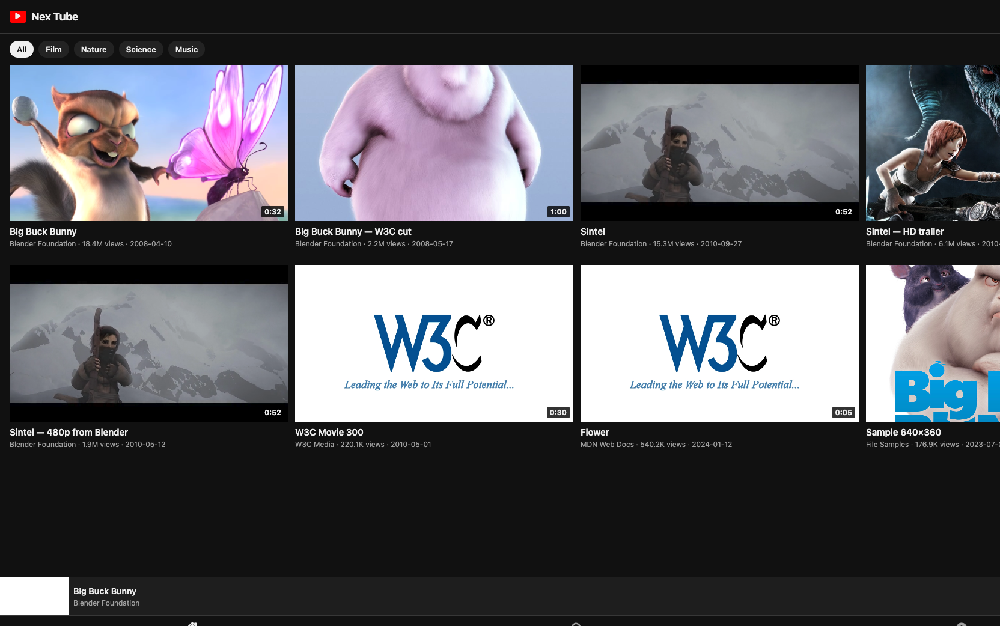

# Nex Tube

A YouTube-style player without ad slots. Close the watch screen and the audio stays up, the same way Premium keeps a video alive on the lock screen.

One Expo codebase covers iOS, Android, tablet, web, and a large-screen / TV layout.

## After install

This is the running app (`npm start` → `w` for web). The mini player at the bottom is still on Big Buck Bunny after the watch pane was closed.



Same shell, animated:


## Run

```bash
npm install
cp .env.example .env
npm start
```

| Command | Target |
| --- | --- |
| `npm run web` | Computer / browser |
| `npm run ios` | iPhone / iPad |
| `npm run android` | Phone / tablet |
| `npm test` | Unit + feature tests |
| `npm run typecheck` | `tsc --noEmit` |

The shelf ships with open movies (Blender, W3C, MDN) so play works with no API key. Set `EXPO_PUBLIC_INVIDIOUS_ORIGIN` to point at your own Invidious host if you want a YouTube-backed catalog.

## Google on every client

Sign-in uses `expo-auth-session` on web, iOS, and Android — not a webview-only path.

```
EXPO_PUBLIC_GOOGLE_WEB_CLIENT_ID=
EXPO_PUBLIC_GOOGLE_IOS_CLIENT_ID=
EXPO_PUBLIC_GOOGLE_ANDROID_CLIENT_ID=
```

Create OAuth clients in Google Cloud for those three platforms. iOS also needs the reversed client ID (the app config writes that URL scheme when the iOS id is present).

Without the ids the rest of the app still runs. The Sign in button tells you which key is missing.

## Playback

- No ad insertion in the player or the chrome
- One `Video` host stays mounted; leaving watch only hides the pane
- iOS `UIBackgroundModes: audio`, Android media playback service
- Lock-screen / Media Session play and pause on web

## Tests

```
npm test
```

Covers catalog mapping, stream pick, the closed-screen audio rule, history/likes, and Google client-id gating.

## License

MIT. alexalghisi
