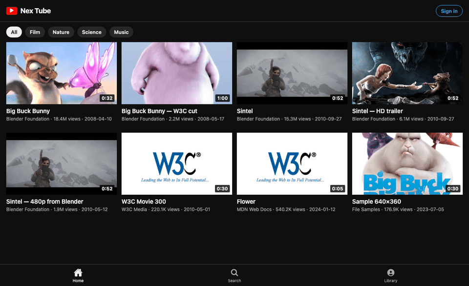

# Nex Tube

A YouTube-style player without ad slots. Close the watch screen and the audio stays up, the same way Premium keeps a video alive on the lock screen.

One Expo codebase covers iOS, Android, tablet, web, and a large-screen / TV layout.

## After install

This is the running app (`npm start` → `w` for web). The mini player at the bottom is still on Big Buck Bunny after the watch pane was closed.


Same shell, animated:



## Run

```bash
npm install
cp .env.example .env
npm start
```

| Command | Target |
| --- | --- |
| `npm run web` | Computer / browser |
| `npm run ios` | iPhone / iPad |
| `npm run android` | Phone / tablet |
| `npm run build` | Web production bundle (`dist/`) |
| `npm run build:ios` | iOS production bundle (`dist/`) |
| `npm run build:android` | Android production bundle (`dist/`) |
| `npm test` | Unit + feature tests |
| `npm run typecheck` | `tsc --noEmit` |

The shelf ships with open movies (Blender, W3C, MDN) so play works with no API key. Set `EXPO_PUBLIC_INVIDIOUS_ORIGIN` to point at your own Invidious host if you want a YouTube-backed catalog.

## Google on every client

Sign-in uses `expo-auth-session` on web, iOS, and Android — not a webview-only path.

```
EXPO_PUBLIC_GOOGLE_WEB_CLIENT_ID=
EXPO_PUBLIC_GOOGLE_IOS_CLIENT_ID=
EXPO_PUBLIC_GOOGLE_ANDROID_CLIENT_ID=
```

Create OAuth clients in Google Cloud for those three platforms. iOS also needs the reversed client ID (the app config writes that URL scheme when the iOS id is present).

On initial launch, users see the Connect with Google screen with options to sign in or Continue as Guest. Returning authenticated users bypass directly to the player. Without the ids the rest of the app still runs. The Sign in button tells you which key is missing.

## Playback

- No ad insertion in the player or the chrome
- Movable floating mini video player (Picture-in-Picture) drag-and-drop anywhere on screen
- One `Video` host stays mounted; leaving watch keeps audio active seamlessly
- iOS `UIBackgroundModes: audio` (system lock-screen playback), Android media playback service
- Lock-screen / Media Session play and pause on web

## Install

Tagged releases publish the same kind of files as [collab](https://github.com/alexalghisi/collab/releases): an Android APK, an unsigned iOS IPA, and a macOS DMG. See [Nex Tube releases](https://github.com/alexalghisi/Nex_Tube/releases).

| File | Install |
| --- | --- |
| `app-release.apk` | Allview / any Android. Allow unknown sources, open the file. |
| `NexTube-unsigned.ipa` | Same as `Collab-unsigned.ipa`. iOS will not install it from Safari. AltStore or SideStore re-signs it with your Apple ID. |
| `NexTube-*-arm64.dmg` | Mac with Apple silicon. Open the DMG and drag the app to Applications. |
| `com.alexalghisi.nextube_1.0.0_all.ipk` | LG webOS, Developer Mode only. Built locally with `npm run package:webos`. |

On iPhone without AltStore, Safari → Share → Add to Home Screen still works while the web app is hosted.

## Allview (Android)

Allview phones, tablets, and Android TVs install a normal APK. Unknown sources must be on. The debug build is signed with the local debug key, which Android accepts for sideload.

```bash
npm run package:android
```

Copy `release-assets/nextube-allview.apk` onto the device and open it. On an Android TV remote, the same package shows in the launcher because the manifest also registers `LEANBACK_LAUNCHER`. Touch is not required.

## LG webOS

LG does not install an APK. The TV package is an `.ipk`, and a shop TV only accepts it while Developer Mode is on.

```bash
npm run package:webos
```

That writes `release-assets/com.alexalghisi.nextube_1.0.0_all.ipk`.

On the TV: Content Store → **Developer Mode** → sign in → Dev Mode On. Note the passphrase.

On the computer, same network as the TV:

```bash
npx -p @webos-tools/cli ares-setup-device
npx -p @webos-tools/cli ares-install --device tv release-assets/com.alexalghisi.nextube_1.0.0_all.ipk
npx -p @webos-tools/cli ares-launch --device tv com.alexalghisi.nextube
```

The pointer on the Magic Remote works on this UI. Closing the watch screen leaves the mini player running inside the app. webOS still stops media when you leave the app entirely; that is the TV, not an ad.

## Tests

```
npm test
```

Covers catalog mapping, stream pick, the closed-screen audio rule, history/likes, and Google client-id gating.

## License

MIT. alexalghisi
